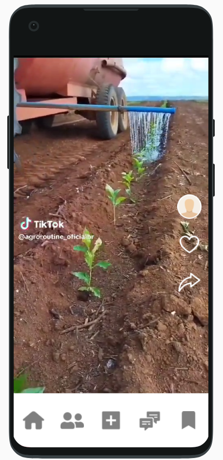

# green-credit

Serpro hackaton code - 2023

  

## Descrição

Aplicativo web desenvolvido em flutter, para a hackthon do serpro
2023, esta aplicação conta com o desenvolvimento de das telas descitas abaixo.

Para a aplicação foram utilizadas as seguintes tecnologias:

  

## Login

  

## Cards

  

## Reels Page

  

## Chat bot page

  

