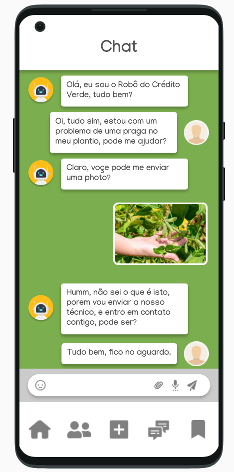

# green-credit

Serpro hackaton code - 2023

  

## Descrição

Aplicativo Mobile desenvolvido em flutter, para a hackthon do serpro
2023, MAPA, esta aplicação conta com o desenvolvimento de das telas descitas abaixo.

Para a aplicação foram utilizadas as seguintes tecnologias:

  

## Login

Tela de login simples, onde é possivel digitar o CCIR e senha,
a mesma tem como função entrada na aplicação assim como o
redireciomento para o singup e o esqueceu a senha.

  

## Cards

Tela de cards, onde é possivel escolher qual o tipo de conhecimento
que deseja se explorar a mesma tem como função ajudar a encrontrar
aqui que é procurado de conteudo dentro do aplicativo.

  

## Reels Page

Tela de Reels, aqui o funcionamento da-se em demonstrar pequenas pirulas
de conhecimento onde é possivel vizualizar e salvar pequenos videos em
formato reels.

  

## Chat bot page

Tela de Chat bot, onde é possivel entrar em contato com um tecnico, tal
processo é automatizado, fazendo assim que o tecnico apenas atue na sua
especialidade.

  

